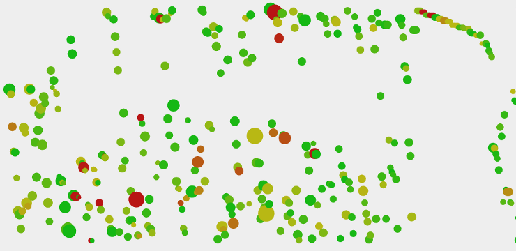

# Git Visualization

Visualize local Git repos. (Work in progress.)

## Usage

Install the dependencies:

    npm install

Build it with `intercessor` in `./build`:

    npm run build

Construct your `commits.csv`. This is described in the next section.

Start it:

    npm run start

See it at [localhost:3000](http://localhost:3000).

## Construct `commits.cvs`

To use this you first have to install `git-plot`.

    npm install git-plot -g

Then make a plot of your local Git usage. In this command I create the file for
all my commits (`--authorRegex 'Paul Nechifor'`) in the directory I store my
projects (`--searchDir /home/p/pro`).

    mkdir static
    git-plot --searchDir /home/p/pro --authorRegex 'Paul Nechifor' -o static/commits.csv

## License

MIT
